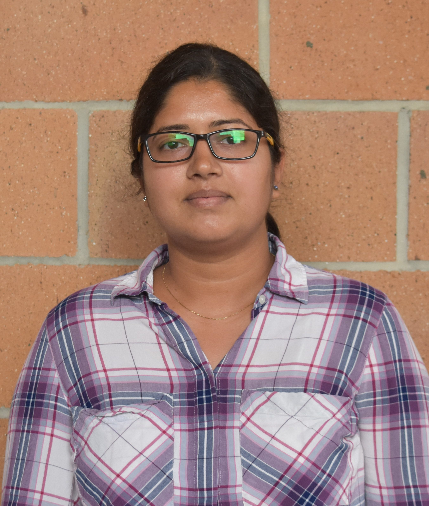
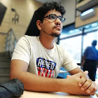

# Overview

In this challenge, we present a novel but challenging task of video understanding in a multi-
modal noisy environment. While image based object detection and recognition has improved
significantly in the last decade, the same has not been replicated in the video domain. Unlike
images, understanding videos has proven to be difficult due to the added complexities of
extra dimension and complicated sequence of motions. One of the major obstacle in learning
better techniques that can understand complex actions in videos is the sheer lack of large
scale annotated data. Large annotated datasets such as ImageNet and Open Image have propelled research in image understanding. The issue with doing this for videos is the
massive cost of annotating millions of videos, which is why only a handful of large scale
video datasets have been produced such as Kinetics 400/600/700, AVA and
Youtube8M. An alternative to annotating such large video datasets is to accumulate the
data from the web using specific search queries. However, this automatic annotation comes
at a cost of variable noise in the data and annotation. As such, there is an ever growing need
to generate better techniques for video action understanding based on such noisy datasets

## Task Descriptions

In this grand challenge we propose three different tasks.

### Task 1: Multi-modal Noisy Learning for Action Recognition

The first task is to use the noisy action dataset to perform video action understanding. For
this task, participants can use all available modalities of the data (raw video data and the
meta data) to perform noisy visual representation learning. The goal of this task is to generate
robust learning methods that can generate meaningful visual representations for video action
recognition. The participants are free to utilize any combination of the modalities made
available to them.
In this task, the participants will have to
pre-train their methods using the noisy action
dataset, and then transfer this learning to a smaller target dataset. We will use UCF-101
dataset as target in this challenge. The participants can use the UCF-101 dataset itself for
fine-tuning the pre-trained models. The final evaluation will be done on the UCF-101 test set. The transfer learning will demonstrate how generalized the visual understanding technique
is and how reasonable the noisy dataset is for visual understanding tasks. There will be two
sets for algorithmic development and training at scale, 25k and 100k splits.

**Mini-set task** This sub-task is for quick algorithm development and faster testing for the
participants. This sub-task will only contain 25K videos with about 200 action classes.

**Full-set task** This sub-task is focused on a large scale algorithm development where the
participants will train their methods on 100K videos. This task will allow participants to
verify their approach on a wider distribution.

### Task 2: Multi-modal Noisy Learning for Video Retrieval

In this task, the participants will be required train models to perform text to video retrieval.
For this task, participants can use all available modalities of the data (raw video data and
the meta data) to perform noisy visual representation learning. The goal of this task is to
generate robust learning methods that can generate meaningful visual representations for
text to video retrieval. The participants are free to utilize any combination of the modalities
made available to them. The participants will finally test the representation quality by fine
tuning on the MSR-VTT dataset. The final evaluation will be done on its test set. Similar
to the first task, there will be two different splits which the participants can utilize.

### Task 3: Multi-modal Noisy Video Understanding

We invite researchers and participants to demonstrate effectiveness of learning from multi-
modal noisy datasets for tasks in video understanding other than those mentioned above. This
task will not be counted towards the leaderboard statistics, however novel and extraordinary
approaches will receive a special mention. Participants can use any split of the dataset
provided.

## About The Dataset

We are releasing two splits: 100k and 25k, along with its meta data.
- 100k Split: Videos, [Metadata](https://drive.google.com/file/d/1f81Q-N7DY21wFenS1ThbgO7kWpWGJseb/view?usp=sharing), [Tags](https://drive.google.com/file/d/11uSVC3dw9Om7bT25hC_pqh7WPNRBQMXW/view?usp=sharing), Features
- 25k Split: Videos, [Metadata](https://drive.google.com/file/d/1y_QP0Vm4KKCaTSTiY3MrX347Fs14kZ1o/view?usp=sharing), [Tags](https://drive.google.com/file/d/1grVNqoR1MobJe0vWYe77zSdbdyYVvHMP/view?usp=sharing), Features

Note:
- Tags json file contains tags associated with each video, as the main metadata file only contains tag IDs.
- Files were compressed using bzip2.

The metadata file will include the following meta information: (Weak) class labels (Concepts), title, description, comments and
tags. Around 39,000 of these videos have geo-location information. The samples will have
multi-labels with average number of labels per video as 6.825 and all examples cover roughly
7000 labels. Each sample also has on an average 11.97 tags assigned to it, with the total
number of tags being 1.4 million in the whole dataset. The average number of comments
per video is 5.57. 
The 25K split covers around 5000 action labels. This split is intended for interested
researchers with limited computational resources, or to benchmark your methods before running on the bigger split. The evaluation of task 1 will be done on the test set of UCF-101 [28] and the task 2 will be evaluated on the test set of MSR-VTT
[34]. We will also provide features for videos in the 25K and the 100K split, extracted using R(2+1)D-d network trained on the Kinetics [18] dataset.

## Important dates

- Challenge Starts: <strong>August, 2021</strong>
- Evaluation Starts: <strong>September, 2021 </strong>
- Paper Submission: <strong>1st October, 2021</strong>
- Notification to Authors: <strong>15th October, 2021</strong>

All deadlines are at midnight(23:59) anywhere on Earth.

## Instructions

We use the same formatting template as ACM Multimedia 2021. Submissions can be of varying length from 4 to 8 pages, plus additional pages for the reference pages. There is no distinction between long and short papers. All papers will undergo the same review process and review period. All contributions must be submitted through CMT.

Submission links for papers will be up soon.

## Leaderboard

The submission links will be up soon.

## Organizers

  

     
    <a href="https://www.crcv.ucf.edu/person/mubarak-shah/">Mubarak Shah</a> 
    University of Central Florida (UCF)
  

  
  

  

  
  

     
  <a href="https://www.comp.nus.edu.sg/~mohan/">Mohan S Kankanhalli</a> 
    National University of Singapore 
  

 
  
  

  

  
  

     
  <a href="http://research.nii.ac.jp/~satoh/index.html">Shin’ichi Satoh</a> 
    National Institute of Informatics
  

  

  
  

     
  <a href="https://www.crcv.ucf.edu/person/rawat/">Yogesh Rawat</a> 
    University of Central Florida (UCF)
  

  

  

     
    <a href="http://midas.iiitd.edu.in/team/rajiv-ratn-shah.html">Rajiv Ratn Shah</a> 
    Indraprastha Institute of Information Technology Delhi
  

  

  

  
  

     
  <a href="https://www.comp.nus.edu.sg/~rogerz/">Roger Zimmermann</a> 
    National University of Singapore
  

  

  

  
  

     
  <a href="https://www.linkedin.com/in/shruti-vyas-42605b70/">Shruti Vyas</a> 
    Center for Research in Computer Vision
    University of Central Florida
  

  

  

  
  

     
  <a href="https://mohitsharma29.github.io/about/">Mohit Sharma</a> 
    Indraprastha Institute of Information Technology Delhi
  

  

  

  
  

     
  <a href="https://www.linkedin.com/in/aayush-jung-rana-5893385b/">Aayush Rana</a> 
    Center for Research in Computer Vision
    University of Central Florida
  

## Volunteers

  

     
    <a href="https://www.linkedin.com/in/raj-aaryaman-p-4b3a70101">Raj Aryaman Patra</a> 
    National Institute of Technology Rourkela
  

  
  

  

  
  

     
  <a href="https://www.linkedin.com/in/harshal-desai-863027147">Harshal Desai</a> 
    National Institute of Technology Jamshedpur
  

